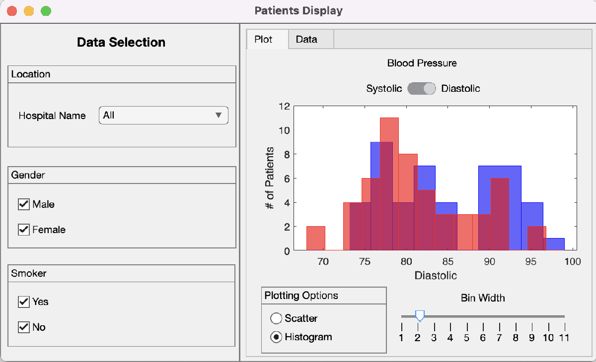
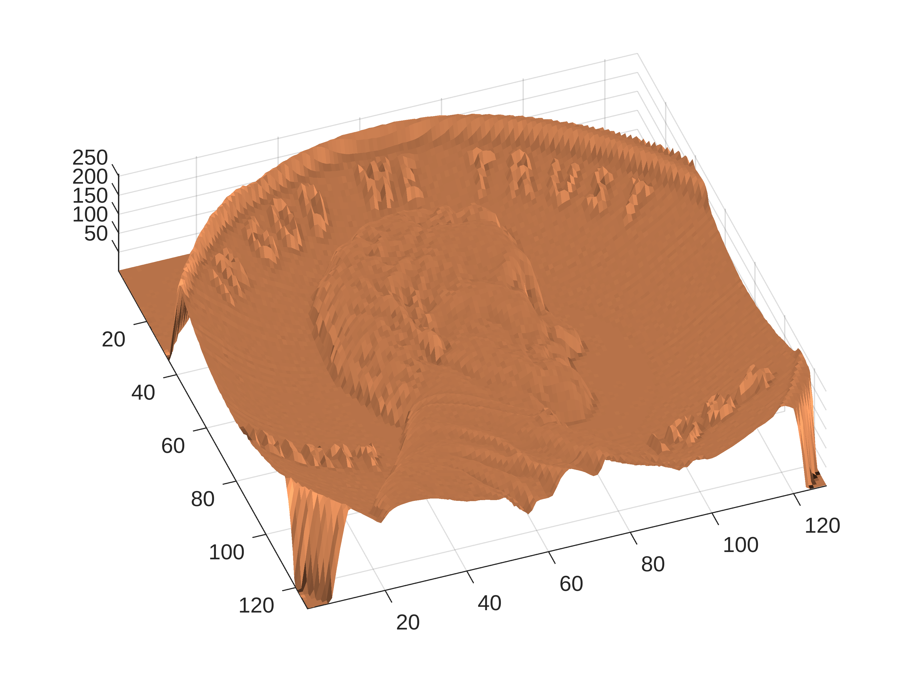

# <span style="color:rgb(213,80,0)">Simple Demo of the App Testing Framework</span>

This is a simple demo of the App Testing Framework, highlighting usage on GitHub hosted runners and generating a report that includes snapshots.


<p style="text-align:left"></p>


```matlab
penny
```

<center></center>

